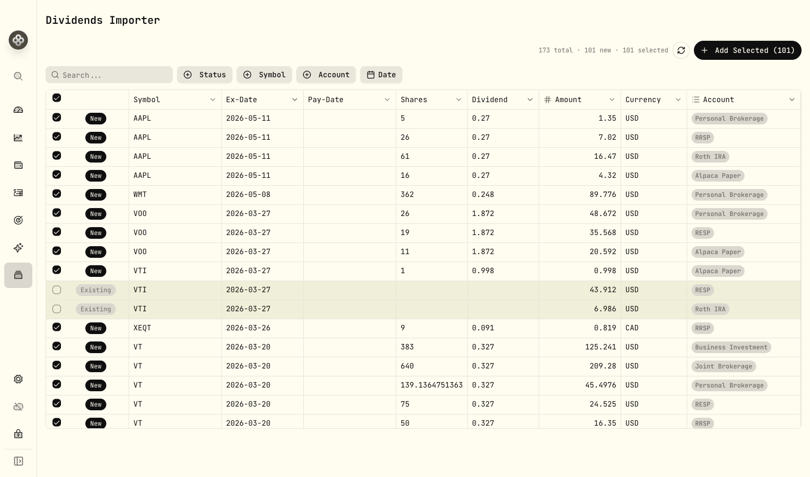
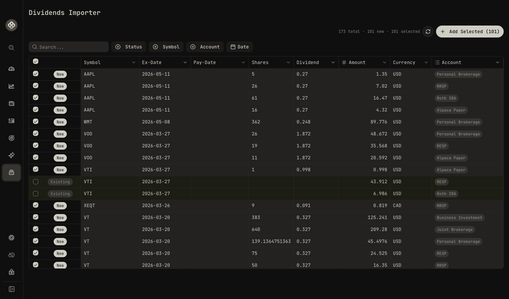

# Dividends Importer

A [Wealthfolio](https://wealthfolio.app) addon that finds missing dividend
activities in your portfolio by fetching historical dividend data from
Wealthfolio market data providers.

## Prerequisite

This addon uses the published Wealthfolio packages (`@wealthfolio/ui`,
`@wealthfolio/addon-sdk`, `@wealthfolio/addon-dev-tools`) from npm, so build/test
commands run standalone after a `pnpm install`.

## What it does

- Scans your current holdings for securities
- Fetches the last 5 years of dividend history from Wealthfolio market data
  providers
- Compares against your existing DIVIDEND activities
- **Only suggests dividends you were eligible for** — uses your
  BUY/SELL/SPLIT/TRANSFER history to compute the exact share count at each
  ex-date, skipping dividends from before you owned the stock
- Calculates the correct dividend amount based on your historical position size
  at each ex-date (not your current holdings)
- Surfaces missing dividends as pre-checked suggestions you can review and
  bulk-add

## Installation

1. Download or build the `.zip` file (see [Build](#build) below)
2. In Wealthfolio, go to **Settings → Addons → Install from file**
3. Select the downloaded `.zip`.

## Build

```bash
# Install dependencies
pnpm install

# Clean, build, and package into a zip
pnpm bundle
```

The zip is written to `dist/`.

## Testing

```bash
pnpm test
```

The automated test suite covers:

- addon registration and disable cleanup
- page rendering
- data hooks for accounts, holdings, asset profiles, market dividends, existing dividends, position activities, dividend suggestions, saving, and local dividend data
- core utilities in `src/lib`

For local iteration:

```bash
# Watch mode
pnpm test:watch

# Coverage report
pnpm test -- --coverage
```

## Development

```bash
# In wealthfolio repo — start the app in addon dev mode
VITE_ENABLE_ADDON_DEV_MODE=true pnpm tauri dev

# In this repo — watch-build the addon and serve it
pnpm dev:server
```

## Screenshots

### Light mode



### Dark mode



## Notes

- Dividend data is fetched through Wealthfolio's configured market data
  providers. This addon requires Wealthfolio 3.6.0 or newer.
- Dividends are deduplicated with a ±3 day window to account for ex-date vs.
  pay-date differences between brokers and market data providers.
- No dividend data is stored by the addon itself — everything lives in
  Wealthfolio's standard activity records.

## License

MIT
